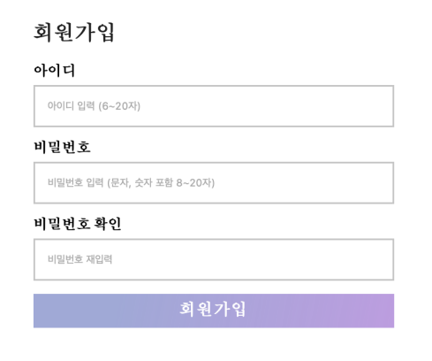
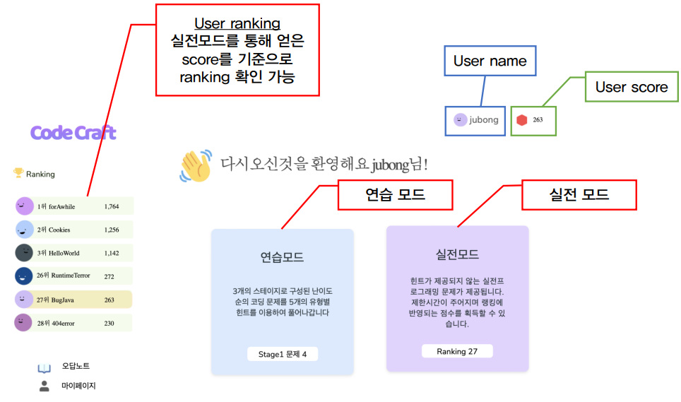
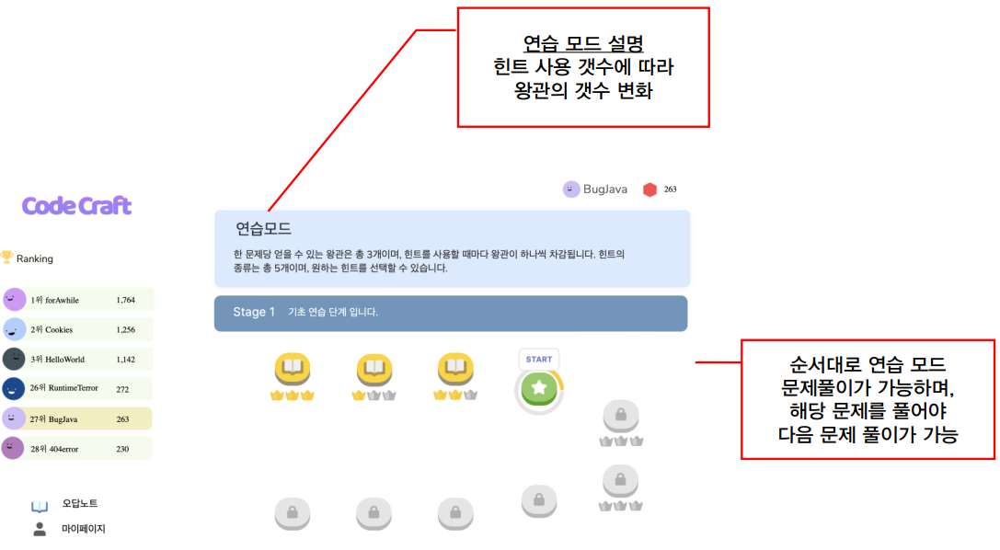
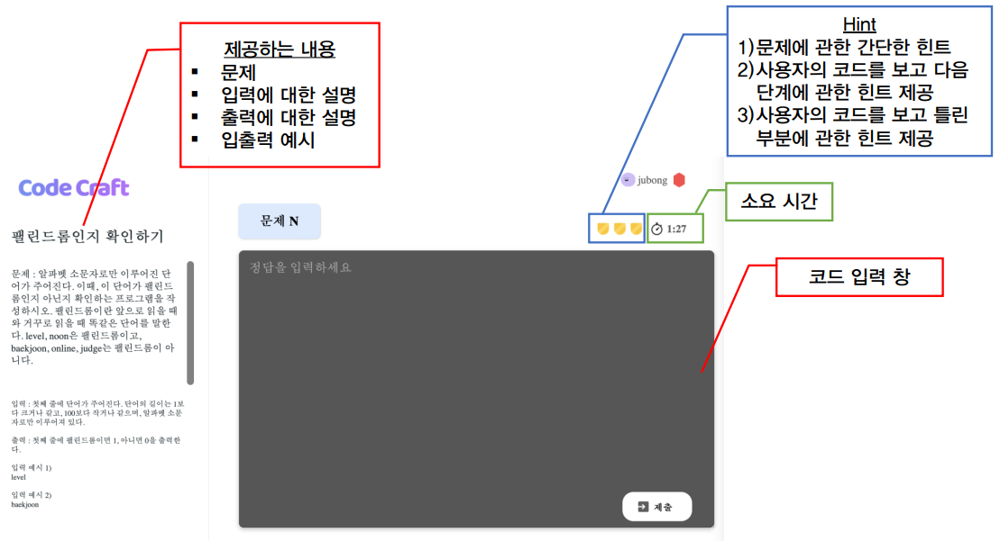
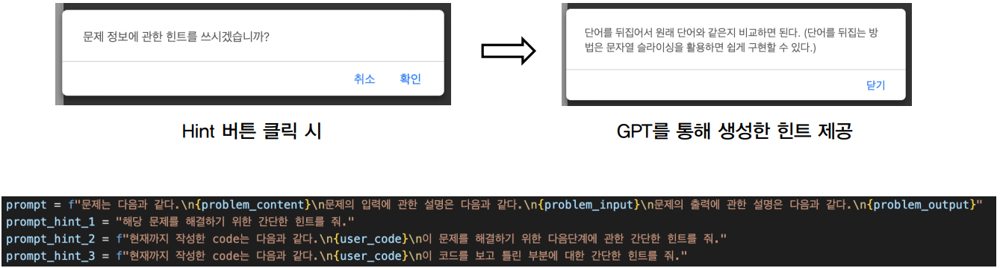
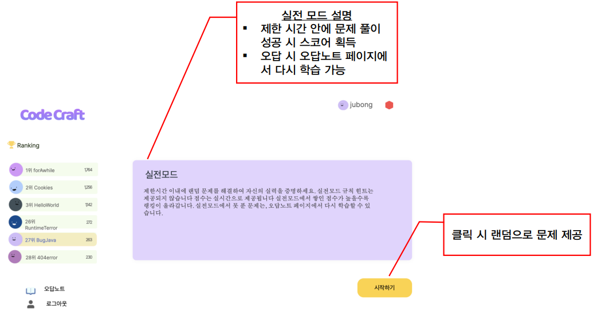
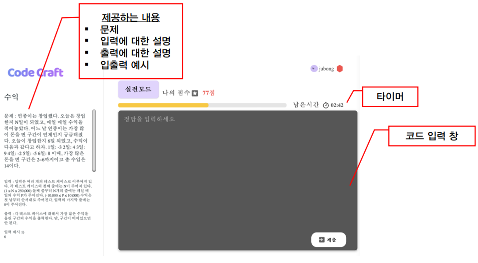
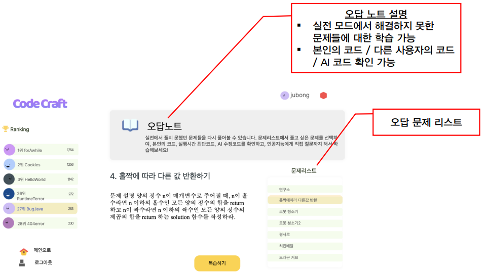
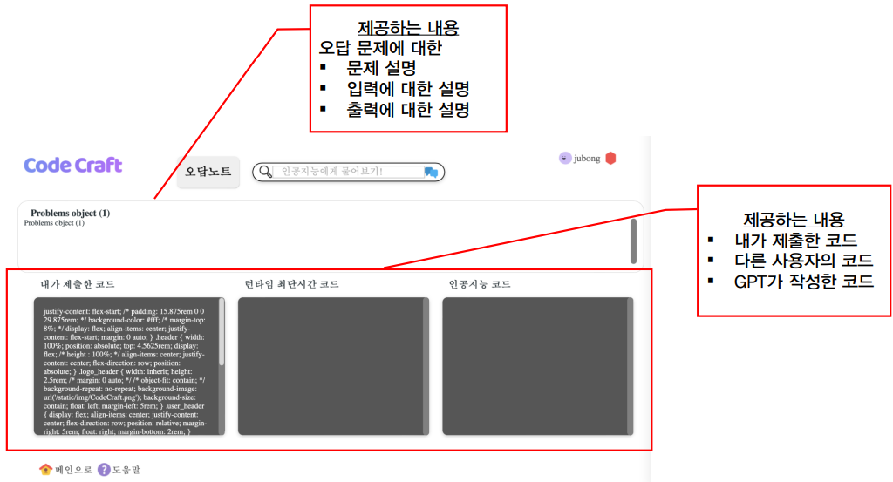

# 2023spring_41class_team9
We provide a web service to users who want to develop their problem-solving skills using Python, helping them to learn and solve problems until the end by providing hints and opportunities to practice.

### Key Features
- Practice mode that allows users to solve problems step by step
- Real mode for competing with other users
- Hints provided using GPT-3 to help users overcome obstacles and solve problems until the end
- Incorrect answer notes that allow users to review their own solutions as well as the solutions provided by GPT-3

### Usage
```sh
# clone this repository first
python ./backend/manage.py runserver
```

### Contents List
- [Login](#login)
  * [Login page](#login-page)
  * [Register Page](#register-page)
- [Main Page](#main-page)
- [Practice Mode](#practice-mode)
  * [Practice Mode Page](#practice-mode-page)
  * [Practice Page](#practice-page)
  * [Hint (Generated by GPT3)](#hint--generated-by-gpt3-)
- [Real Mode](#real-mode)
  * [Real Mode Page](#real-mode-page)
  * [Real Mode](#real-mode-1)
- [Review Note](#review-note)
  * [Review Note Page](#review-note-page)
  * [Review Note](#review-note-1)

## Login
### Login page
<p align="center"></p>

### Register Page
<p align="center"></p>

## Main Page
- User ranking: Users can check the ranking based on the scores obtained through the real mode.
- User name and User score are displayed.
- Provides two modes: practice mode and real mode.
<p align="center"></p>

## Practice Mode
### Practice Mode Page
- Explanation of the practice mode is provided.
- The number of crowns varies depending on the number of hints used during problem-solving.
- In the practice mode, problem-solving is possible in the order of the map, and the next problem can only be solved after solving the problem in the corresponding stage.
<p align="center"></p>

### Practice Page
- Problem
  - problem content
  - description of inputs
  - description of outputs
  - sample input/output examples

- 3 types of hints
  - a brief hint about the problem
  - a hint about the next step based on the user's code
  - a hint about the incorrect parts based on the user's code

- The timer is displayed during problem-solving
- There is a code input box
<p align="center"></p>

### Hint (Generated by GPT3)
<p align="center"></p>

## Real Mode
### Real Mode Page
The Real Mode is a format where problems need to be solved within a limited time, and points are earned upon successful completion. In case of incorrect answers, it is possible to review and learn again on the [Review Note](#review-note) page. Clicking the "Start" button provides random problem prompts.
<p align="center"></p>

### Real Mode
- Problem
  - problem content
  - description of inputs
  - description of outputs
  - sample input/output examples

- The timer is displayed during problem-solving
- There is a code input box
<p align="center"></p>

## Review Note
### Review Note Page
- The review notes allow for learning from the problems that were not solved in the real mode. You can review your own code, other users' code, and AI-generated code.
- A list of incorrect problems is displayed.
<p align="center"></p>

### Review Note
- Problem
  - problem content
  - description of inputs
  - description of outputs
 
- Provided Contents
  - The User's code
  - Other Users' code
  - GPT generated code
<p align="center"></p>

## Collaborators

|Name|                    GitHub ID                    |        Role        |
|:---:|:-----------------------------------------------:|:------------------:|
|박주봉 (Jubong Park)|     [Park-Jubong](https://github.com/Park-Jubong)     | Backend Developer  |
|김민성 (MinseongKim)|         [minseong0106](https://github.com/minseong0106)         |      Backend Developer      |
|신새별 (Saebyeol Shin)|        [SaebyeolShin](https://github.com/SaebyeolShin)        |  Frontend Developer   |
|이하은 (Haeun Lee)|     [fun-soul](https://github.com/fun-soul)     | Frontend Developer  |
|최현진 (Hyeonjin Choi)| [HyeonjinChoi](https://github.com/HyeonjinChoi) |   Backend Developer   |
