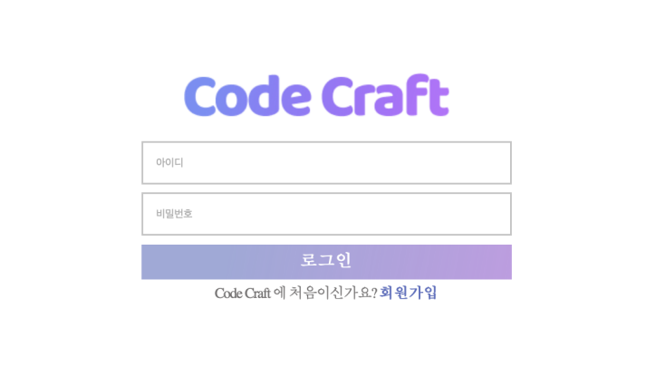

# 2023spring_41class_team9
We provide a web service to users who want to develop their problem-solving skills using Python, helping them to learn and solve problems until the end by providing hints and opportunities to practice.

### Key Features
- Practice mode that allows users to solve problems step by step
- Real mode for competing with other users
- Hints provided using GPT-3 to help users overcome obstacles and solve problems until the end
- Incorrect answer notes that allow users to review their own solutions as well as the solutions provided by GPT-3

## Login
### Login page

